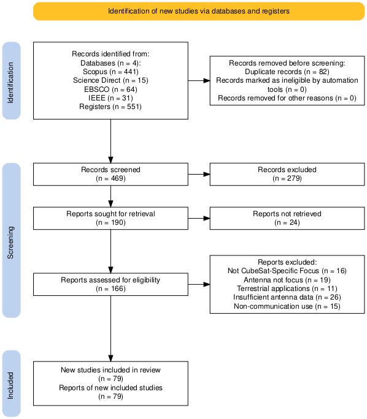

# Systematic Review: Microstrip Antenna Design for CubeSat

A comprehensive systematic literature review on microstrip antenna design for CubeSat platforms, following the PRISMA 2020 guidelines.

## Overview

This repository contains the complete dataset and analysis of a systematic review examining microstrip antenna design methodologies for CubeSat applications. The review analyzes 79 peer-reviewed studies published between 2000-2025.



## Research Objectives

The review addresses four main specific objectives (OE):

| Objective | Description | Studies | Robustness |
|-----------|-------------|---------|------------|
| **OE1** | EM Simulation and Optimization | 50 | High |
| **OE2** | Experimental Validation | 50 | High |
| **OE3** | Feeding Integration | 14 | Mixed |
| **OE4** | Manufacturing and Scalability | 13 | Moderate |

## Repository Structure

```
.
├── README.md                    # This file
├── PRISMA_METADATA.md           # Complete PRISMA 2020 protocol documentation
├── prismaRevSisCubesat.png      # PRISMA flow diagram
├── baseDatos.csv                # Consolidated database (551 records)
├── nuevoCubeSat.ris             # Bibliography in RIS format
├── accessRev03.pdf              # Access review documentation
│
├── recoleccion/                 # Data collection phase
│   ├── scopus.csv               # Scopus search results (441 records)
│   ├── ebsco.csv                # EBSCOhost search results (64 records)
│   ├── IEEE.csv                 # IEEE Xplore search results (31 records)
│   ├── sd.csv                   # ScienceDirect search results (15 records)
│   ├── consolidado.xlsx         # Consolidated raw data
│   └── inFase1.xlsx             # Phase 1 input data
│
├── screening/                   # Screening phase
│   ├── baseDatos.csv            # Database for screening
│   ├── outFase1.csv             # Phase 1 exclusions (279 records)
│   ├── outFase2.csv             # Phase 2 exclusions (99 records)
│   └── incluidos.xlsx           # Final included studies (79 records)
│
├── articulosPDF/                # Full-text PDFs of included studies
│
├── objetive-dataDriven/         # Cross-cutting inductive analysis
│
├── OE1/                         # Specific Objective 1: EM Simulation
│   ├── grupoA.csv               # Group A data
│   ├── grupoB.csv               # Group B data
│   ├── grupoC.csv               # Group C data
│   ├── datos_grupos_completos.json
│   ├── Figure_*.tiff            # Publication-quality figures
│   └── *.txt                    # Analysis documentation
│
├── OE2/                         # Specific Objective 2: Experimental Validation
│   ├── grupo[A-D].csv           # Categorized data
│   ├── fig_*.py                 # Figure generation scripts
│   ├── fig_*.png                # Generated figures
│   └── generate_all_figures.py
│
├── OE3/                         # Specific Objective 3: Feeding Integration
│   ├── grupo[A-D].csv           # Categorized data
│   ├── figura_3_3_*.py          # Figure generation scripts
│   ├── Figure_3_3_*.png         # Generated figures
│   └── generar_todas_figuras.py
│
└── OE4/                         # Specific Objective 4: Manufacturing
    ├── grupo[A-C].csv           # Categorized data
    ├── figure[1-5]_*.py         # Figure generation scripts
    ├── Figure*.png              # Generated figures
    └── generate_figures.py
```

## Search Strategy

**Databases**: Scopus, EBSCOhost, IEEE Xplore, ScienceDirect

**Query**:
```
(TITLE-ABS-KEY(("microstrip antenna" OR "patch antenna" OR
"printed antenna" OR "microstrip patch"))
AND TITLE-ABS-KEY(("CubeSat" OR "small satellite" OR "nanosatellites")))
AND PUBYEAR > 1999 AND PUBYEAR < 2027
AND (LIMIT-TO(DOCTYPE,"ar") OR LIMIT-TO(DOCTYPE,"cp"))
```

**Timeframe**: 2000-2025

## PRISMA Flow Summary

| Phase | Records |
|-------|---------|
| Initial records identified | 551 |
| Duplicates removed | 82 |
| Records screened (Phase 1) | 469 |
| Excluded (Phase 1) | 279 |
| Full-text assessed (Phase 2) | 190 |
| Excluded (Phase 2) | 99 |
| Full-text retrieved | 79 |
| **Studies included in review** | **79** |

## Key Findings

### Dominant Configurations
- **Simulation tools**: HFSS (56%), CST (38%), FEKO (12%)
- **Frequency bands**: S-band dominant (~32 studies)
- **Validation**: Anechoic chamber (40%), VNA (30%)
- **Feeding**: Simple feeding (64%), Coaxial/probe (57%)
- **Manufacturing**: Conventional PCB (53.8%)

### Critical Gaps Identified

| Gap | Deficit | High Maturity |
|-----|---------|---------------|
| Antenna-platform interaction | 71% | 29% |
| Thermal validation | 86% | 14% |
| Mechanical integration | 79% | 21% |
| Power-system integration | 71% | 29% |
| Cross-platform validation | >92% | <8% |

## Inclusion Criteria

1. Microstrip/patch/printed/planar antenna technology
2. Explicit design for CubeSat/nanosatellites (1U-6U)
3. Empirical evidence (simulation results, experimental validation, or integration analysis)
4. Peer-reviewed articles or conference proceedings
5. Full text available in English

## Exclusion Criteria

- E1: Generic small satellite mentions without CubeSat constraints
- E2: Microstrip antennas as secondary components
- E3: Primarily terrestrial applications
- E4: Absence of technical parameters or performance metrics
- E5: Physical phenomena experiments where communication is secondary
- E6: Inaccessible full text

## Reproducibility

All data extraction, screening decisions, and analysis scripts are included in this repository to ensure full reproducibility of the systematic review.

### Requirements for Figure Generation

```bash
pip install matplotlib numpy pandas seaborn
```

## Protocol

This systematic review follows the **PRISMA 2020** guidelines. See [PRISMA_METADATA.md](PRISMA_METADATA.md) for the complete protocol documentation.

**Reference**: Page MJ, McKenzie JE, Bossuyt PM, et al. The PRISMA 2020 statement: an updated guideline for reporting systematic reviews. BMJ 2021;372:n71. doi: 10.1136/bmj.n71

## License

This dataset is provided for academic and research purposes.

## Citation

If you use this dataset or analysis in your research, please cite:

```bibtex
@misc{cubesat_microstrip_review_2024,
  title = { Systematic Evidence of Progressive Workflow  Discontinuities in CubeSat Microstrip Antenna  Design: From Electromagnetic Optimization to  System Integration},
  author = {Segundo-Francisco Segura A.},
  year = {2024},
  note = {PRISMA 2020 systematic review},
  url = {https://github.com/sefran1020/RevSisCubesatNov25}
}
```

## Contact

- **Investigador Principal**: Msc. Ing. Segundo Francisco Segura Altamirano
- **Institución**: Universidad Nacional Pedro Ruiz Gallo
- **Email**: sseguraal@unprg.edu.pe
- **ORCID**: 0000-0002-0103-7222

---

*Last updated: November 2025*
